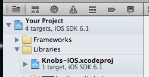
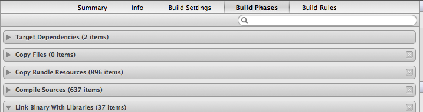

knobs
=====

Mac side debugging tool for iOS apps

# SETUP
Knobs has two parts: A desktop app and an iOS library. This section walks you through adding the library to your project, building the desktop app, and letting them talk to each other.

### Checking Out

You can checkout knobs wherever you want, but normal practice would be as a submodule in your iOS app's repo. For the rest of this HOWTO we're going to assume it's at
    <your project dir>/Libraries/Knobs.
    
So to check it out you'd do e.g.
    git submodule add <knobs git url> Libraries/Knobs

### Adding As A Subproject
Find Knobs/Knobs-iOS.xcodeproj and drag it into your XCode project as a subproject. It should look something like this:

### Linking In and Adding Header Search Paths
Go to the Target Settings > Build Phases and add libKnobs-IOS.a to your Target Dependencies and Link Binaries With Libraries.

Now you need to tell XCode where to find the Knobs headers.
Go to Build Settings and search for "Header Search Paths".
Add
    <place you put knobs>/iOS/Include/
e.g. with our above example:
    $(SRCROOT)/Libraries/Knobs/iOS/Include/

### Enabling In Your App
Now you're ready to actually activate knobs in your app. We recommend you only enable it in DEBUG builds because it opens a pipe to your app that can do all sorts of things. Add the following to somewhere early in your app like -[YourAppDelegate application:didFinishLaunchingWithOptions:]

    #if DEBUG
        [[EKNKnobs sharedController] registerDefaultPlugins];
        [[EKNKnobs sharedController] start];
    #endif

The default plugins include:
- A simple logger that can log rich media (images and colors) in addition to text. See EKNLoggerPlugin.h.
- A tool that lets you manipulate live manipulate properties of views from your mac. See EKNViewFrobPlugin.h.
- A tool that lets you controls to the mac app that execute callbacks on the iOS side. See EKNLiveKnobsPlugin.h.

### Running the Desktop App
Now that knobs is enabled in your iOS, you want to talk to it using the desktop app. Make sure your Mac and your iOS device are on the same network. Open up Knobs/Knobs.xcodeproj. Make sure the "Knobs" target is selected and hit Run. If your iOS app is running with Knobs enabled, it should show up in the device picker sheet that appears when you run Knobs on your Mac.

# TODO
Knobs is very much not a finished product, but it is useful today. Here is a somewhat complete list of things that could be improved.

## Plain Old Bugs
- Fix menu items so there are only relevant ones
- Fix issue where showing a color doesn't work on the first try
- Fix occasional client crash on disconnect

## Application UI
- Make window title useful (show connection state)
- Redo the tabs to be more powerful, visually sane, and scalable
- Save runs all in one window so the flow is more like instruments, especially so that the connection starts at app launch
- About box with names of all contributors
- Set proper minimum window size
- Menu items+key commands for switch tab

## General Plugin Features
- Easier plugin installation
- More plugins
- Settings UI for adding additional plugin paths or possibly a way to configure this dynamically
- Version plugins

## Improved Error handling/robustness

## Logger Plugin
- Log datetime with each item
- Improve desktop display to support more types, especially nested plist ones
- Make thread safe
- Improve logger so that colors and images can be saved
- Improve logger visual style
- Export logger data: images/colors/entire contents
- HTML escape logged strings
- Add conveniences
- Get rid of EKNWireColor. It turns out that UIColor and NSColor are bridged when unarchiving.

## KnobGeneratorView
- More editors
- Rework the rect editor to support arbitrary field names. To support things like UIEdgeInsets
- Disable the frobber when the connection closes.
- Tighten row spacing and generally pretty it up.
## ViewFrobPlugin
- Add more fields to UIView subclasses
- Consider using method swizzling to do push instead of poll.
## LiveKnobsPlugin
- Allow using multiple channel names/provide a default channel
- Use NSCollectionView to stick multiple editors in a single row.
- Visual improvements.
- Send all exiting knobs when a connection is opened.

## Auto-Updating
- Maybe not worthwhile since you pretty much need to checkout the code anyway

## Tests
- Per plugin tests
- App tests
- Connection tests

## Documentation
- How to write a plugin, device side and desktop side
- How to add an editor.
- How to add custom view frob properties to your view
- FAQ
